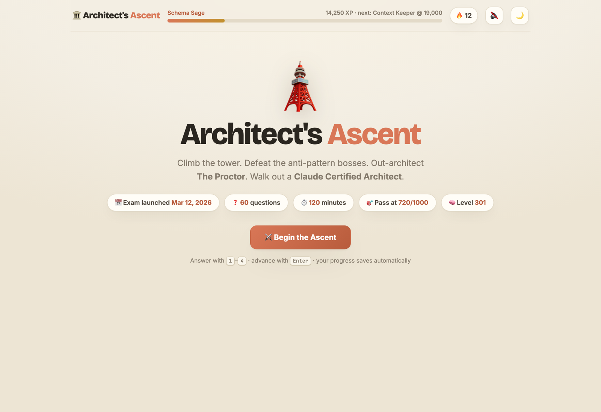
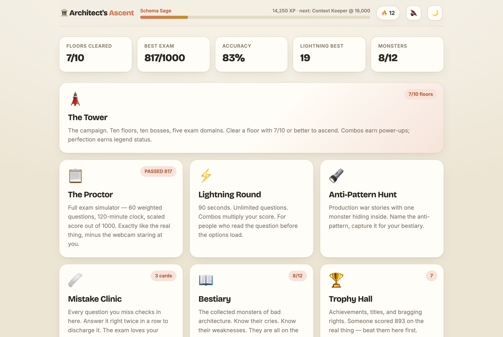
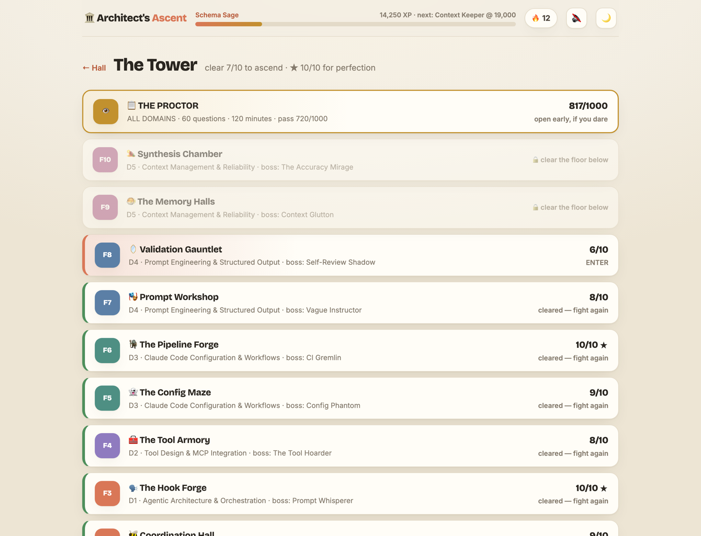
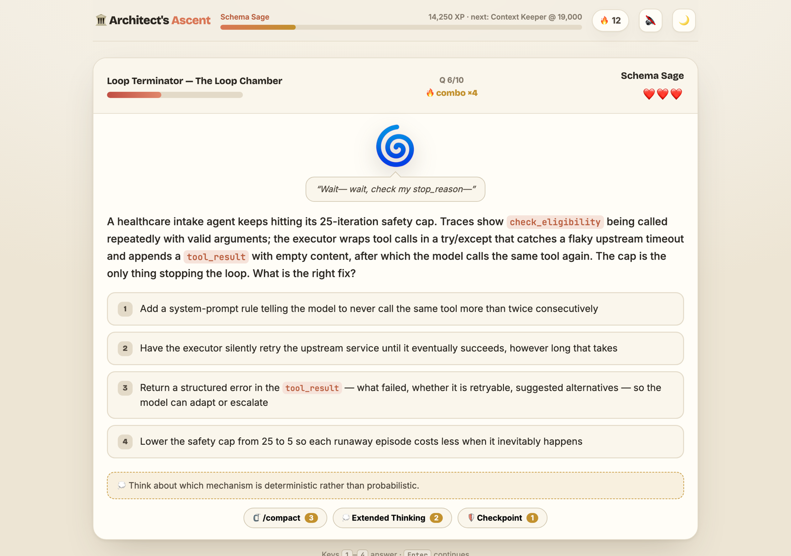
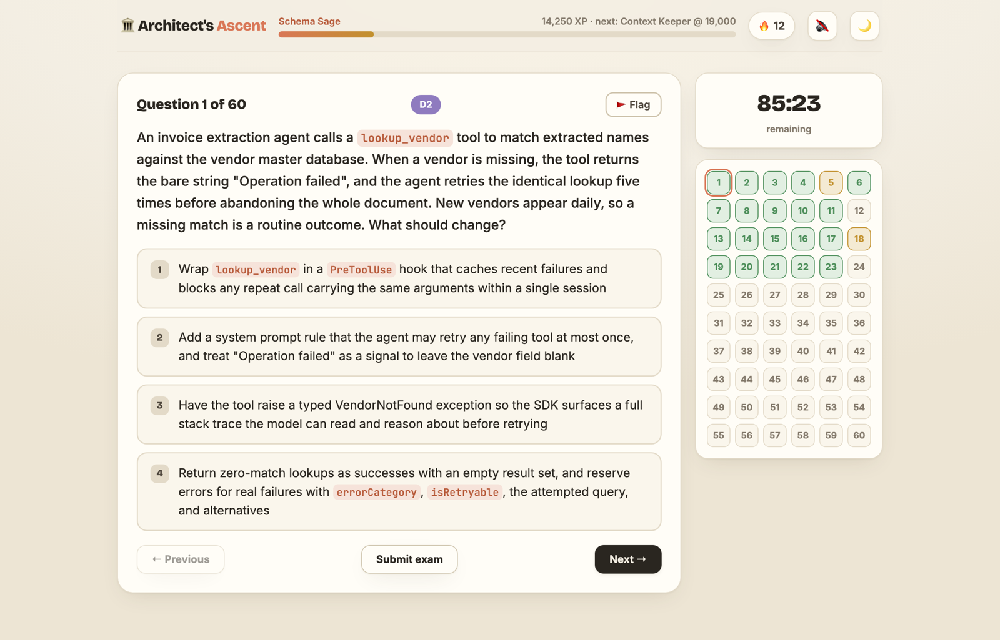
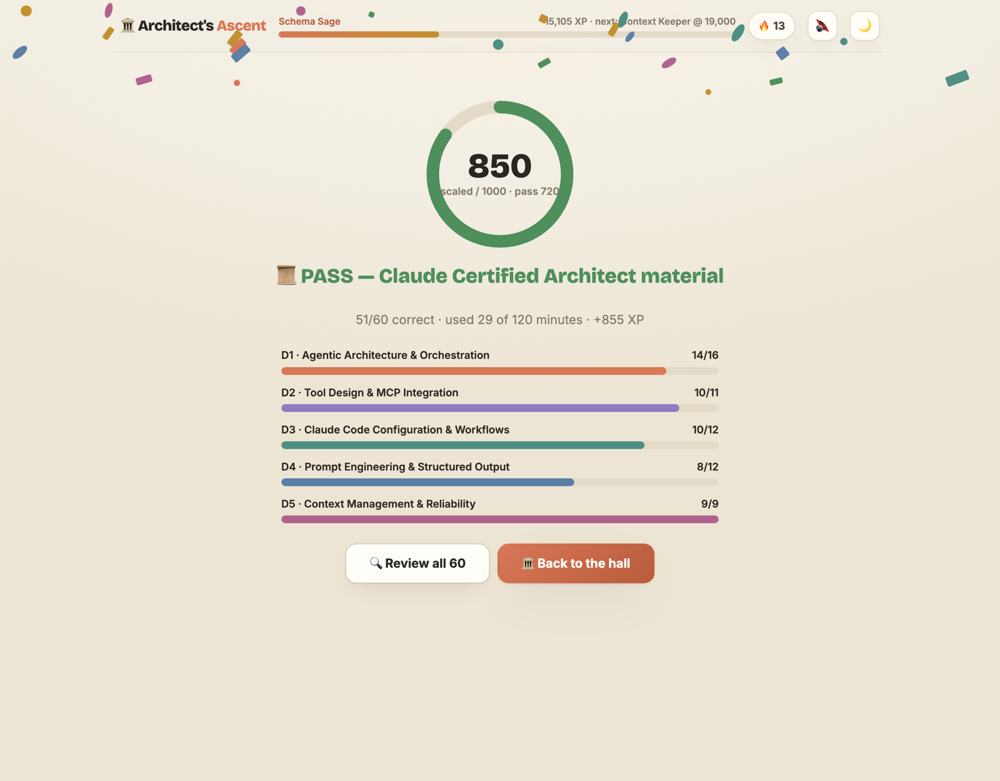
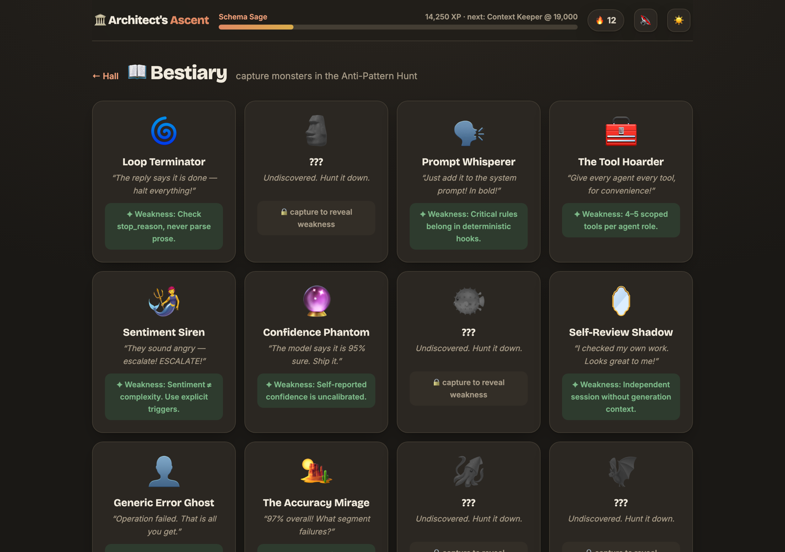
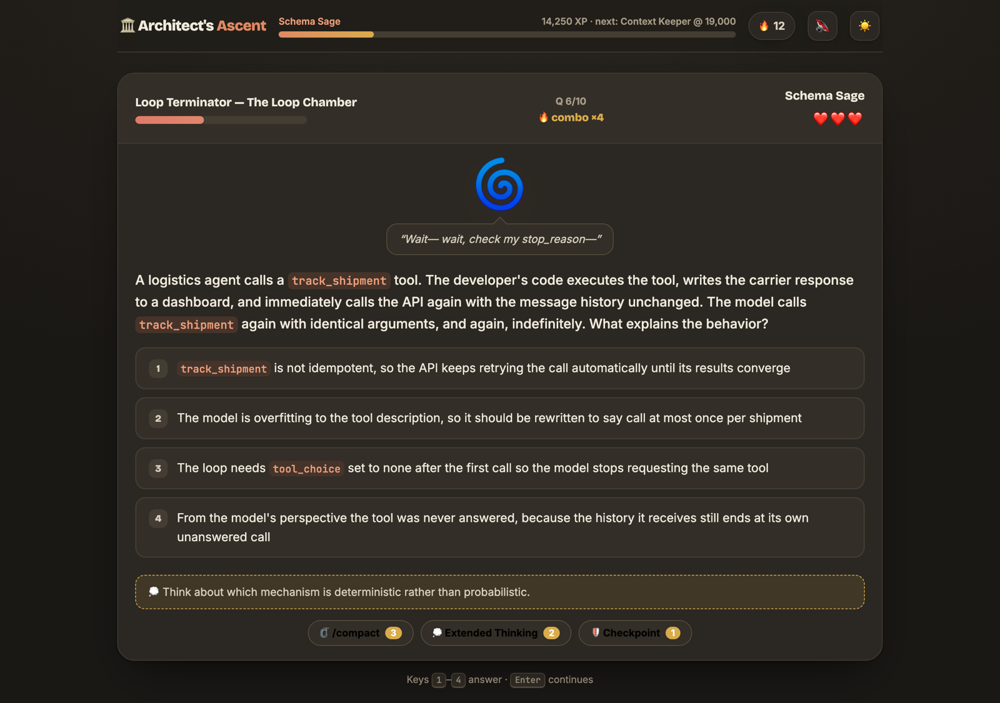

<div align="center">

# 🗼 Architect's Ascent

### Pass the **Claude Certified Architect** exam by playing a game.

*Climb the tower. Defeat the anti-pattern bosses. Out-architect The Proctor.*

[](https://pankajarm.github.io/cca-f-game/)
&nbsp;

&nbsp;


<br>

[**▶︎ pankajarm.github.io/cca-f-game**](https://pankajarm.github.io/cca-f-game/) — no install, no signup, progress saved in your browser.

<br>



</div>

---

A study game for the **Claude Certified Architect — Foundations (CCA-F)** exam,
built from the ground up and current as of **June 2026**. Instead of grinding a
PDF of flashcards, you climb a ten-floor tower, fight a boss made of each way
real agent systems break, and finish against **The Proctor** — a faithful
60-question, 120-minute exam simulator. Every one of the **192 questions** was
written to the real exam blueprint and then put through an adversarial fact-check.

It's one folder of static files. Nothing to build, nothing to install.

<div align="center">

|  |  |
|:--:|:--:|
|  |  |
| **Pick your mode** — campaign, exam sim, lightning, hunt | **The Tower** — ten floors, ten bosses, five domains |

</div>

## ⚔️ Fight the anti-patterns, don't memorize them

Each floor boss *is* a production failure mode — and it talks back. The Loop
Terminator stopped reading your agent's output three turns ago. The Tool Hoarder
gave one agent eighteen tools and wonders why it picks wrong. You beat them by
choosing the answer that fixes the **root cause**, not the one that bolts a patch
onto a broken design.

<div align="center">



*10 questions, 3 hearts, combo streaks that land critical hits and drop power-ups:*
*🗜️ `/compact` trims two wrong options · 💭 Extended Thinking reveals a hint · 🛡️ Checkpoint forgives a miss.*

</div>

## 📋 Then survive The Proctor

The exam simulator is the real thing minus the webcam: **60 questions drawn to
the exact domain weights**, a **120-minute** countdown, flag-for-review, a live
question navigator, and a scaled score out of **1000** with the **720** pass line —
followed by a per-domain breakdown so you know exactly which floor to re-climb.

<div align="center">

|  |  |
|:--:|:--:|
|  |  |
| **Real exam conditions** — timer, flags, navigator | **Scaled score + domain breakdown** |

</div>

## 🎮 Six ways to study

| Mode | What it is |
|---|---|
| 🗼 **The Tower** | The campaign. Ten floors, ten bosses with banter and grudges. Clear at 7/10 to ascend; ★ for a perfect 10. |
| 📋 **The Proctor** | Faithful exam sim — 60 weighted questions, 120-min clock, /1000 scoring, full answer review. |
| ⚡ **Lightning Round** | 90 seconds, unlimited questions, combos multiply your score. For people who read the question before the options load. |
| 🔦 **Anti-Pattern Hunt** | Twelve production war stories, each hiding one monster. Name it to capture it. |
| 🩹 **Mistake Clinic** | Every question you miss checks in here. Get it right twice in a row to discharge it — spaced repetition aimed at your weak spots. |
| 🏆 **Trophy Hall** | 14 achievements, 7 titles from *Apprentice* to *Certified Architect*, daily streaks. |

<div align="center">

|  |  |
|:--:|:--:|
|  |  |
| **The Bestiary** — collect all 12 anti-pattern monsters | **Proper dark mode** for late-night cramming |

</div>

## 🧠 The question bank is the point

`questions.js` holds **192 scenario questions** — 150 across the ten floors, 30
cross-domain exam-pool questions, and 12 hunt vignettes. They were authored
against a June-2026 brief of the real exam — `stop_reason` loop mechanics, hooks
vs prompts, MCP config scopes, the `CLAUDE.md` hierarchy, skills frontmatter,
`claude -p` CI patterns, batch API economics, schema design, context management,
escalation policy — then **every question was audited by an adversarial reviewer
agent** that argued for each distractor like a grumpy test-taker filing an appeal.
Anything defensible got rewritten.

> **The principle baked into every answer:** the correct option fixes the **root
> cause**; the distractors are patches on a flawed design. (Better tool
> descriptions before a routing classifier. A deterministic hook before a
> sterner prompt. A nullable schema field before a "don't fabricate" warning.)

## 📐 The exam this trains you for

| Fact | Value |
|---|---|
| Exam | Claude Certified Architect — Foundations (CCA-F) |
| Launched | March 12, 2026 |
| Format | 60 multiple-choice scenario questions |
| Time | 120 minutes |
| Scoring | Scaled out of 1000, **pass at 720** |
| Level | 301 — expects 6+ months of production Claude experience |
| Cost | $99 (free for early partner-org employees) |
| Scenario pools | 6 total, 4 randomly selected per sitting |

**Domain blueprint** — the simulator draws with exactly these weights, and the
tower is laid out to match:

| Domain | Weight | Tower floors |
|---|---|---|
| D1 · Agentic Architecture & Orchestration | 27% | F1 Loop Chamber · F2 Coordination Hall · F3 Hook Forge |
| D2 · Tool Design & MCP Integration | 18% | F4 Tool Armory |
| D3 · Claude Code Configuration & Workflows | 20% | F5 Config Maze · F6 Pipeline Forge |
| D4 · Prompt Engineering & Structured Output | 20% | F7 Prompt Workshop · F8 Validation Gauntlet |
| D5 · Context Management & Reliability | 15% | F9 Memory Halls · F10 Synthesis Chamber |

## ▶︎ Play it

**Online — nothing to install:** **[pankajarm.github.io/cca-f-game](https://pankajarm.github.io/cca-f-game/)**

**Locally:**

```bash
python3 scripts/serve.py        # → http://localhost:4173
```

…or just open `index.html` in any browser. Progress (XP, floors, bestiary, exam
history, mistake deck) saves automatically to your browser's localStorage.

## 🖨️ Prefer paper?

`questions.js` is the single source of truth; the printable study materials are
generated from it with `python3 scripts/build_tests.py`:

- `practice-tests/test-01…10-*.md` — 15 questions per floor, answers in collapsible spoilers
- `practice-tests/full-exam-01.md` — a fixed 60-question paper exam with answer key
- `practice-tests/anti-pattern-hunt.md` — the twelve war stories, printable
- `GAME.md` — quest log, XP rules, and how to run boss battles with Claude Code as your dungeon master
- `STUDY_GUIDE.md` — a 12-week, 1-hour-a-day syllabus mapped to the tower

## ✨ Design

Built for long study sessions, not eye strain. **Inter** for prose, **Bricolage
Grotesque** for display, and monospace (JetBrains Mono) reserved for actual code
tokens like `stop_reason` and `.mcp.json` — which the game detects and typesets
automatically. Warm ivory-and-terracotta by day, a proper dark mode by night,
answers by keyboard `1`–`4`, audio you can mute.

---

<sub>Not affiliated with or endorsed by Anthropic. Question content is original,
written to the public shape of the exam — not dumps. If you can clear the tower
and beat The Proctor at 720+, you're studying the right things. Go book the real one. 🎓</sub>
